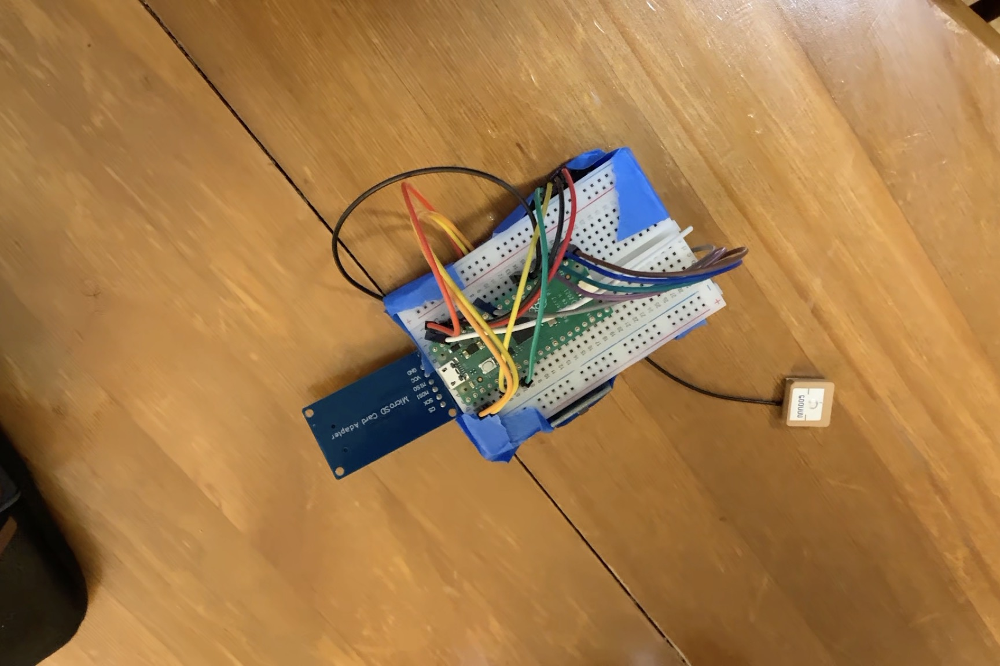
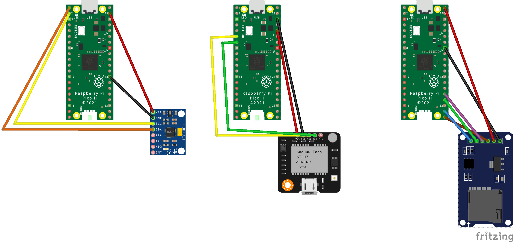
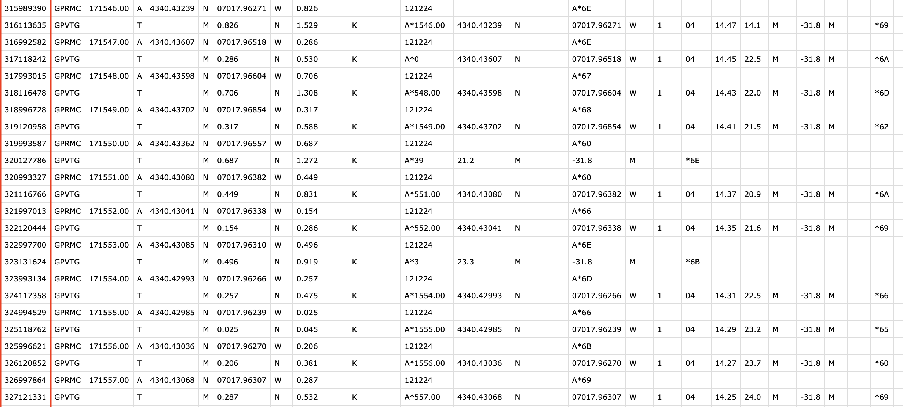
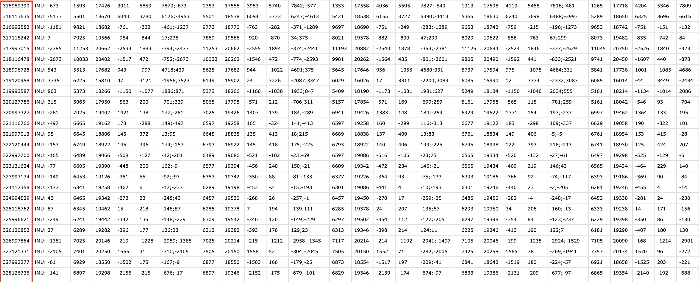

# Wearable GPS Tracker

## Description
The built embedded system serves as a wearable GPS tracker that logs key position and movement data in a structured manner for further analysis. The power and high frequency updates of the GPS module, allows for position data to be captured accurately. Leveraging the GPS module with the IMU ensures that sudden rapid movement data is also obtained. This is critical and provides the ability calculate more advanced metrics. Data is logged as CSV files onto a micro SD card.

## Prerequisites:
### GPS Module
| GPS   | UART1 | GPIO  | Pin   | 
| ----- | ----  | ----- | ---   | 
| RX    | TX    | 4     | 6     | 
| TX    | RX    | 5     | 7     | 
| GND   |       |       | 38    | 
| 3v3   |       |       | 36    | 

### MPU6050 Module
| MPU   | I2C0  | GPIO  | Pin   | 
| ----- | ----  | ----- | ---   | 
| SCL   | SCL   | 1     | 2     | 
| SDA   | SDA   | 0     | 1     | 
| GND   |       |       | 28    | 
| VSYS  |       |       | 39    | 

### MicroSD Module
|       | SPI0  | GPIO  | Pin   | SPI       | MicroSD   |  
| ----- | ----  | ----- | ---   | --------  | --------- |
| MISO  | RX    | 16    | 21    | DO        | DO        |
| MOSI  | TX    | 19    | 25    | DI        | DI        | 
| SCK   | SCK   | 18    | 24    | SCLK      | CLK       | 
| CS0   | CSn   | 17    | 22    | SS or CS  | CS        | 
| GND   |       |       | 18,33 |           | GND       | 
| VBUS  |       |       | 40    |           | VBUS      | 

- Raspberry Pi Pico
- GPS module (used GT-U7 module for this model)
- Inertial Measuring Unit module (MPU6050)
- Micro SD Card module

## Techniques:
To achieve the goal of tracking and logging data, special techniques were required.
- IMU readings can be quite noisy when the module is first initialized. To mitigate this, I introduced a calibration step at the start of every power-up. The calibration involved calculating the accelerometer and gyroscope’s x, y, and z axes. This consisted of using 2000 samples accumulated for each axis, then dividing each axis by the samples. The values of the offsets were then subtracted from each IMU reading and logged as the calibrated reading. (Note: This calibration method may still be refined or reworked to produce the best results)
- The IMU produces sample readings at a higher rate than the GPS. Therefore, for each GPS reading one would have approximately 100 IMU readings. Having all these readings was not necessary. I attempted to synchronize the sampling rates by using a time offset calculation with the built-in Pico clock but was not getting the results I wanted. I then decided to keep a circular buffer of the latest five IMU readings and log those with each GPS reading that was received. This made it so for every GPS log there would be
five IMU readings that could be used to detect movement from the GPS point.
- I began by using the GPS's GPGGA NMEA sentence, which provides UTC time and positional data. However, I transitioned to using the GPRMC sentence, as its UTC time is explicitly tied to the position fix, making it more reliable for calculating metrics such as distance over time. Additionally, I included GPVTG sentences, which provide ground speed in km/hr. This data enhanced the tracker’s ability to calculate advanced metrics like speed and movement intensity.
- GPS readings and IMU readings are stored in separate files, with a unique ID linking corresponding readings. The unique ID was
generated using the Pico’s time function, ensuring precise synchronization between the two datasets.

## Results
Data was captured and logged correctly following a trial run. Below the respective IMU and GPS csv files are displayed and can be synchronized together by their unique ID.

## References
- [Carl's repo](https://github.com/carlk3/no-OS-FatFS-SD-SPI-RPi-Pico?tab=readme-ov-file)
- [Pico SDK](https://github.com/raspberrypi/pico-sdk)